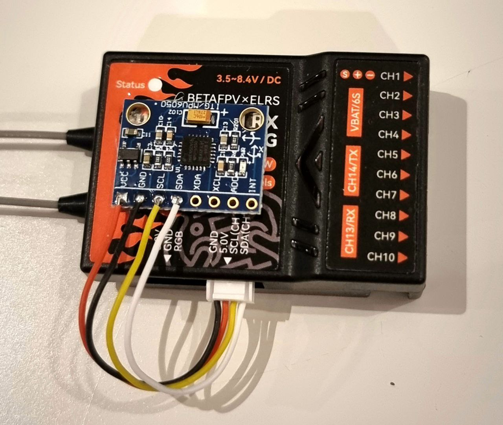

## ExpressLRS RX with Gyro Support

This branch adds support for an external i2c gyroscope for various stabilization
modes.

This is an experimental branch not ready for prime time.

Experiment at your own risk.

## Todo List

- [x] Global servo output limits
- [x] LUA PID adjustment settings
- [x] LUA Input channel assignments
- [x] LUA Output channel assignments
- [x] Automatic subtrim detection
- [x] Scale corrections according to channel limits
- [ ] Add generic mixer (gyro -> channel)
  - [ ] Preset for V-Tail mixing
  - [ ] Preset for Elevon mixing
  - [ ] Conditional mixing, i.e. nose wheel correction when gear down
- [ ] Add gyro orientation configuration
- [ ] Standardize and document gains across modes
- [x] Gyro mode: Rate
- [ ] Gyro mode: Lock / Hold
- [x] Gyro mode: Safe
- [x] Gyro mode: Level
- [x] Gyro mode: Launch (Level + pitch up)
- [x] Gyro mode: Hover
- [ ] Gyro mode: Knife Edge (Quart lock)

## Setup

The gyro settings are available through the
[ExpressLRS Lua script](https://www.expresslrs.org/quick-start/transmitters/lua-howto/).

### Finding the settings menus

1. First launch the ExpressLRS Lua script.
1. Go to "Other Devices".
1. Select your receiver.
1. If your receiver is correctly flashed you will see gyro menu items.

### Gyro Inputs

In the "Gyro Inputs" menu you can setup mappings between input channels to gyro
functions.

The gyro input functions are:

* Roll input
* Pitch input
* Yaw input
* Mode - Selection of stabilization mode
* Gain - Gyro Gain 0% - 100%

### Gyro Outputs

In the "Gyro Outputs" menu you can setup mappings between gyro functions and PWM
output channels.

The gyro output functions are:

* Aileron output
* Elevator output
* Rudder output
* Elevon output
* V-Tail output

For each channel you can setup gyro output inversion. A typical setup is having
two aileron servos where one of the output channels needs to be reversed.

### Gyro Modes

A input channel configured for "Mode" in the "Gyro Inputs" menu can be used to
select the active stabilization mode.

#### Rate Mode

This is the most basic gyro mode. Changes to the angular velocity in any
direction will result in a correction.

### Heading Hold / Heading Lock Mode

Not yet implemented.

#### SAFE Mode

In this mode the gyro will work to limit pitch and roll angles within the configured limits.

#### Level Mode

In this mode the gyro will work to keep the pitch and roll angles at zero when
channel inputs are zero.

If the roll stick command is 50%, the gyro will attempt to keep the roll angle
at 50% of the max roll angle.

#### Hover Mode

In this mode the gyro will add corrections to elevator and rudder channels in
order to keep aircraft pointing directly upwards.

## DIY Hardware

The test hardware currently used is a BetaFPV SuperP receiver with a GY-521 MPU-6050 I2C module.

